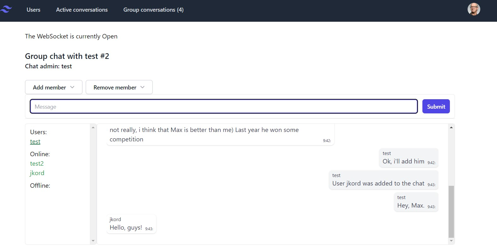

## Django Chat Boilerplate (Websockets)

This boilerplate is made to test Django Channels for chat application, also it can be used as template for any websocket Django app.
The code is deeply inspired and based on [/justdjango/django_chat](https://github.com/justdjango/django_chat) (big thanks guys!). You can find more info about source and a great step-by-step instruction [here](https://justdjango.com/blog/chat-app-django-channels). 

This code is not ready for production purposes from the box.

### App consists off:

- Django backend server (protocol server Daphne, Redis for Channels Layers)
- Simple React frontend for testing

### Setting up for development

- Install requirements - `python pip install -r requirements.txt`
- Build Redis docker image - `docker-compose -f docker-compose.dev.yml build`
- Migrate Django db - `python manage.py makemigrations && pythone manage.py migrate`
- Add React components: `npm install`

### Basic Commands

1. Create django users for testing - `python manage.py createsuperuser`. 
I advise creating second (or more) user through admin panel
2. Start Redis - `docker-compose -f docker-compose.dev.yml up`
3. Start backend server - `python manage.py runserver`
3. Start frontend - `npm run start`
4. Now you can go to `http://localhost:3000` and test boilerplate

### Features

1. Private chats
1. Group chats
1. Notifications about unread messages, new messages, user join, user add to group chat

### Screenshot

